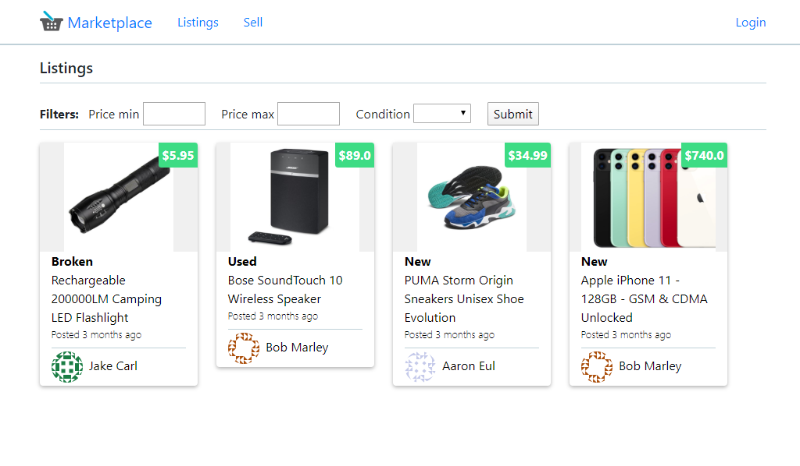
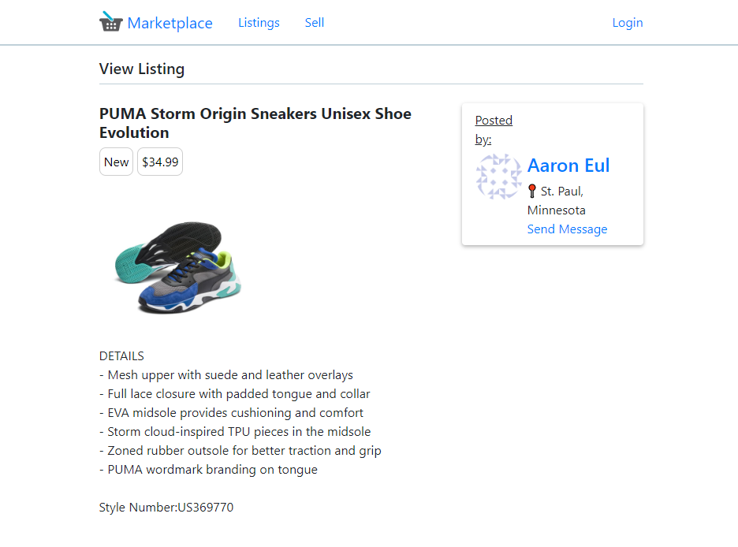
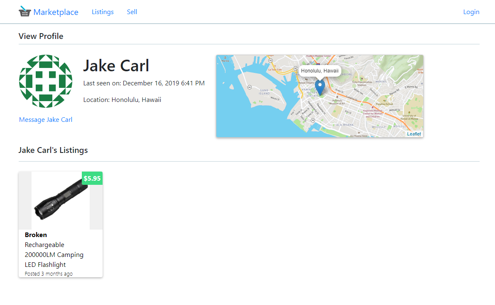

This is a demo app I built using Flask to learn how to create web apps in Python. It is a marketplace app for buying and selling things online. It features user accounts, listing items for sale, messaging users, and more.

### Screenshots
Browse all listings

View listing details

User profile page

